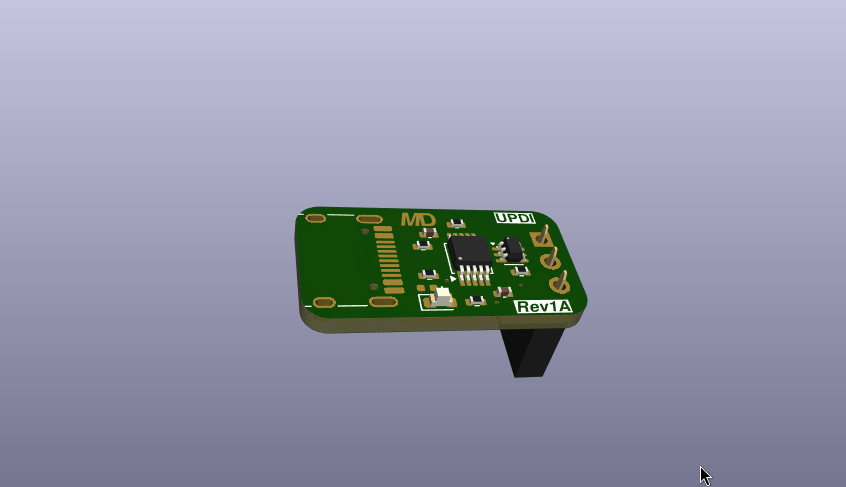

Main project Page: [Here](https://github.com/ILikeBWRs/MicroDev128)

---

# MicroDevUPDI
 A UPDI programmer for the MicroDev128 Series. Compatible with most computers (Linux, Windows, Mac). Based on the CH340E USB to serial chip. This is a simple universal USBtoUDPI converter. 

 Designed on a two layer board feturing reverse polarity protection. Files included for KiCad 10. 

See Document Repo for technical specs: [Here](https://github.com/ILikeBWRs/MicroDev128-Documentation)

Thanks to PCBWay for sponsoring this project!

 ---

 For more information on ordering etc see the main project page. 

 ---

 Revision: *1A*

 Document Version: *1.00*
